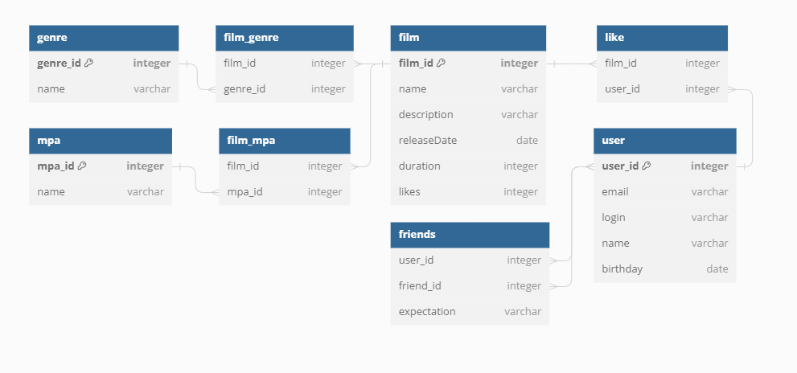

# java-filmorate

Данный проект исользует язык программирования Java, сделан при помощи Spring Boot.

В этом проекте есть:

* Юзер
  1) Создание
  2) Редактирование
  3) Удаление (юзера)
  4) Добавление в друзья
  5) Удаление из друзей
  6) Поиск юзера(зная его id)

* Фильмы
  1) Создание 
  2) Редактирование
  3) Удаление (фильмов)
  4) Поставить лайк фильму
  5) Удалить лайк
  6) Найти определенный фильм


-----
Схема базы данных проекта:


---

Примеры запросов на SQL
* Получения списка пользователей
```sql
SELECT *
FROM User
```

* Получение списков друзей всех пользователей:
```sql
SELECT u.user_id,
       f.friend_id
FROM user AS u
LEFT JOIN friends AS f ON u.user_id=uf.user_id
ORDER BY u.user_id;
```

* Получение списка всех фильмов:
```sql
 SELECT *
 FROM film
```

* Получение списка всех фильмов с упорядочиванием по количеству лайков:
```sql
SELECT *
FROM film
ORDER BY likes;
```

* Получение списка фильмов и их жанров

```sql
SELECT f.name,
       g.name
FROM film AS f
         LEFT JOIN film_genre AS fg ON f.film_id = fg.film_id
         LEFT JOIN genre AS g ON fg.genre_id = g.genre_id;
```

